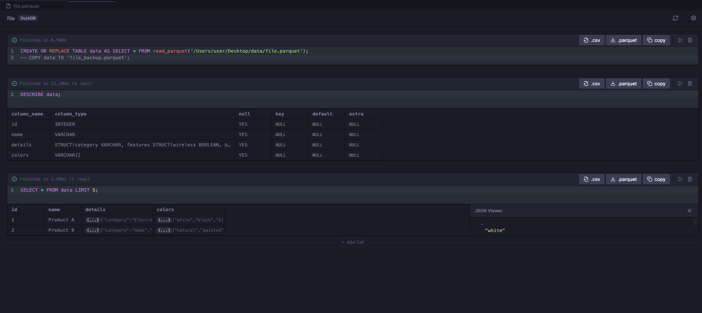

# DuckDB Notebook
 
 Open CSV or Parquet files with a DuckDB-backed Notebook interface. Run multiple SQL queries in separate cells, view results in interactive tables, and export data.
 
 
 
 ## Features

### 1. Interactive Notebook
- **Smart Execution**: Run cells with `Cmd+Enter` or `Shift+Enter` (runs and adds a new cell below).
- **Cell Management**: 
  - **Drag & Drop**: Reorder cells by dragging the handle.
  - **Add/Remove**: Insert new cells between existing ones or delete them.
- **Cancellation**: Stop long-running queries with the Stop button.

### 2. Rich Data Viewer
- **Interactive Tables**: Scrollable results with sticky headers.
- **JSON Support**: Automatically detects and renders JSON objects/arrays in a collapsible tree view.
- **NULL Handling**: Visually distinguishes `NULL` values from empty strings.
- **Clickable Links**: Automatically detects and links URLs in result cells.
- **Column Types**: Displays DuckDB column types in usage.

### 3. Supported Formats
- **CSV**: Automatic dialect detection, with specific handling for headers.
- **Parquet**: High-performance native support.

### 4. Customization & Security
- **Settings Modal**: Configure behavior via the settings gear icon:
  - **Text Wrap**: Toggle text wrapping in grid cells.
  - **JSON Parsing**: Force JSON parsing for ambiguous columns.
  - **Preview Limit**: Set the default number of rows to fetch.
- **Security**: Explicit permission prompts for accessing external files (e.g., `read_csv('/abs/path.csv')`).

### 5. Export
- **One-Click Export**: Download cell results as **CSV** or **Parquet** files directly from the cell header.
- **Copy to Clipboard**: Copy data formatted for spreadsheet pasting.
 
 
 
 ## Notes
 - DuckDB runs in the webview via `@duckdb/duckdb-wasm`, bundled locally in `media/duckdb` (no CDN required at runtime).
 - For large datasets, limit your queries; only the first 100 rows are shown by default when opening a file.
